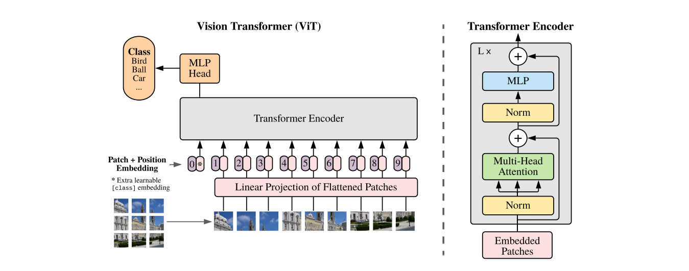

# Markdown语法

本章节笔记主要来源于B站视频：《[Markdown 文档基础语法（基于 IDEA/Typora 讲解最新版）4K蓝光画质 程序员必备技能 强烈推荐](https://www.bilibili.com/video/BV1eJ4m157kC?vd_source=0065bcaca8da62886ead74747cc410e0)》。

## 什么是Markdown？

- Markdown （以下写作markdown）用于编写结构清晰、易维护的纯文本笔记，广泛应用于博客、Github的README等日常场景。是程序员、科研人员的必备技能，也是科研的基础知识。

- markdown 是一种轻量级标记语言，具有一定的格式化效果。通过使用markdown语法，用户可以快速地将纯文本格式转化为格式化文档，例如标题、列表、链接、图片等。

- markdown 同样拥有丰富的第三方生态，就我目前地所学知识来说，Markdown 第三方生态提供了Markdown2Word、Markdown2PDF、Markdown2HTML等工具，方便用户将Markdown文档转换为其他格式的文档。对于格式功能程度，我认为txt＞markdown＞word。word提供了丰富的格式支持但大部分场景下提高了使用成本，因此word更适用与正式场景。而markdown的格式化程度要大于txt（纯文本格式），提供了基础的结构化排版功能，因此markdown更适合日常笔记、博客、结构化网页等场景。

- 值得注意的是，markdown的文件通常以.md或.markdown为扩展名，常用的渲染工具有Typora、Obsidian、IDEA/VScode里的插件等等。

## 文本基础语法

### 输出纯文本

```markdown
这是一段普通文本，会被直接打印。
```  

**渲染效果：**  
这是一段普通文本，会被直接打印。

**总结：**  
纯文本不需要任何标记符号，可被markdown直接输出。

---

### 文本换行

```markdown
这是第一行文本。这是第二行文本。

这是第一行文本。
这是第二行文本。

这是第一行文本。（此处所有两个空格符然后接ENTER换行）  
这是第二行文本。

这是第一行文本。

这是第二行文本。
```

**渲染效果：**  
这是第一行文本。这是第二行文本。

这是第一行文本。
这是第二行文本。

这是第一行文本。  
这是第二行文本。

这是第一行文本。

这是第二行文本。

**总结：**  
空2格再接ENTER实现换行效果。按两次ENTER实现段落换行效果。后者相比前者，行间距变大(不过部分渲染效果好像受到编辑器影响，如我的VScode插件与本网站的markdown渲染规则有小量差异，我以网站的markdown渲染规则为基础)。此外单个ENTER换行只会充当一个空格符的效果。

---

### 文本加粗

```markdown
**这是加粗文本**  
__这是加粗文本__
```

**渲染效果：**  
**这是加粗文本**  
__这是加粗文本__

**总结：**  
使用两个星号（\*\*）或两个下划线（\_\_）包围文本可以实现加粗效果。但更推荐使用星号（\*\*），因为下划线在某些编辑器中不能被正确解析。

---

### 文本斜体

```markdown
*这是斜体文本*  
_这是斜体文本_
```

**渲染效果：**  
*这是斜体文本*  
_这是斜体文本_

**总结：**  
使用一个星号（\*）或一个下划线（\_）包围文本可以实现斜体效果。但更推荐使用星号（\*）。

---

### 文本加粗斜体

```markdown
***这是加粗斜体文本***
___这是加粗斜体文本___
**_这是加粗斜体文本_**
```

**渲染效果：**  
***这是加粗斜体文本***  
___这是加粗斜体文本___  
**_这是加粗斜体文本_**

**总结：**  
使用三个星号（\*\*\*）或三个下划线（\_\_\_）包围文本可以实现加粗斜体效果。也可以使用两个星号（\*\*）或两个下划线（\_\_）包围一个星号（\*）或一个下划线（\_）来实现加粗斜体效果。更推荐使用星号（\*\*\*）或（\*\* \*）来实现加粗斜体效果。

---

### 删除线

```markdown
~~这是删除线文本~~
```

**渲染效果：**  
~~这是删除线文本~~

**总结：**  
使用两个波浪线（\~\~）包围文本可以实现删除线效果。

---

### 混合使用

```markdown
**这是加粗文本**  
***这是加粗斜体文本***  
***~~这是加粗斜体删除线文本~~***
~~***这是加粗斜体删除线文本***~~
```

**渲染效果：**  
**这是加粗文本**  
***这是加粗斜体文本***  
***~~这是加粗斜体删除线文本~~***
~~***这是加粗斜体删除线文本***~~

**总结：**  
markdown的文本标记符可以混合使用，达到组合的效果，且对与标记符顺序不是那么敏感。

---

## 段落基础语法

### 分割线

```markdown
段落1

---
***
___

段落2
```

**渲染效果：**  
段落1

---
***
___

段落2

**总结：**  
使用三个或以上的短横线（-）、星号（*）、下划线（_）可以实现分割线效果。分割线前后需要空一行，否则会将前文变成标题格式。这种标题声明格式使用频率低且可被一种可读性更高的方式替代，因此不推荐使用。下面会介绍如何进行标题声明。

---

### 多级标题

```markdown
# 一级标题
## 二级标题
### 三级标题
#### 四级标题
##### 五级标题
###### 六级标题
```

**渲染效果：**


**总结：**  
使用1-6个#号加空格可以实现1-6级标题的声明，markdown支持1-6级标题。且一级标题最好确保一个markdown文件里只出现一次。

---

## 列表与勾选框

### 有序列表

```markdown
1. 第一项
2. 第二项
3. 第三项

普通文本
2. 第一项
1. 第二项
```

**渲染效果：**

1. 第一项
2. 第二项
3. 第三项

普通文本

2. 第一项
1. 第二项

**总结：**  
有序列表使用数字加点号（.）加空格来声明，数字可以重复，markdown会自动根据第一个列表的顺序进行枚举编号。因此一旦有序列表的首项声明了数字，后续的有序列表项可以使用任意数字，markdown会自动根据首项的数字进行排序。  
弹幕补充：MD032规定：列表前后都应该被空白行包围。

---

### 无序列表

```markdown
- 第一项
- 第二项
- 第三项
* 第一项
+ 第一项
```

**渲染效果：**
- 第一项
- 第二项
- 第三项
* 第一项
+ 第一项
  
**总结：**  
无序列表使用短横线（-）、星号（*）、加号（+）加空格来声明，三者的渲染效果相同，但不允许混合使用。

---

### 列表嵌套

```markdown
- 第一项
    - 子项一
    - 子项二
- 第二项
    - 子项三
    - 子项四

1. 第一项
    1. 子项一
    2. 子项二
2. 第二项
    1. 子项三
    2. 子项四
```

**渲染效果：**

无序列表嵌套：

- 第一项
    - 子项一
    - 子项二
- 第二项
    - 子项三
    - 子项四

有序列表嵌套：

1. 第一项
    1. 子项一
    2. 子项二
2. 第二项
    1. 子项三
    2. 子项四

**总结：**  
列表嵌套通过在子列表项前添加4个英文空格来实现。无序列表和有序列表连续展示时，建议用文字、标题或注释隔开，避免不同 Markdown 渲染器把它们合并成同一个列表块。

---

### 列表结束

```markdown

- 第一项
文本内容

- 第二项（两个空格）  
文本内容

- 第三项

文本内容
```

**渲染效果：**

- 第一项
文本内容

- 第二项（两个空格）  
文本内容

- 第三项

文本内容

**总结：**  
列表结束必须通过两个ENTER换行来结束列表项，跳出列表块。当列表项后使用1个ENTER换行时，正如之前的表现一样，markdown只会在列表后插入一个空格接着渲染文本内容；而如果使用文本换行（两个空格+ENTER）则会在列表项的下一行插入同级文本，即缩进相同；只有使用段落换行（两个ENTER）才能跳出列表块，渲染为列表外的文本内容。  
弹幕补充：markdown中双空格回车相当于word中的shift+enter，本质上“换行”；而markdown中的双回车相当于是word中的enter，本质上是“分段”。

---

### 勾选框

```markdown
- [ ] 第一项
- [x] 第二项
* [ ] 第三项
```

**渲染效果：**

- [ ] 第一项
- [x] 第二项

* [ ] 第三项

**总结：**  
勾选框使用列表声明字符（- / * / +）加空格加中括号（[ ]）来声明，空格表示未选中（空白方框），x表示选中（勾选方框）。在 MkDocs 中需要启用 `pymdownx.tasklist` 扩展，并且列表前要保留空行，否则可能会被解析成普通段落文本。

---

## 代码块

### 段落级代码块

````markdown
    import torch
    torch.cuda.is_available()

```python
import torch
torch.cuda.is_available()
```
````

**渲染效果：**

    import torch
    torch.cuda.is_available()

```python
import torch
torch.cuda.is_available()
```

**总结：**  
代码块有两种声明方式：缩进4个空格或使用三个反引号（```）包围代码块。使用三个反引号时，可以在反引号后面指定代码语言（如python、java、c++等），以便渲染器进行语法高亮显示。

---

### 行内代码块

```markdown
这是行内代码块 `code`
```

**渲染效果：**
这是行内代码块 `code`

**总结：**  
行内代码块使用单个反引号（`）包围代码。适用于文本中嵌入代码片段的场景。

---

## 引用文本

```markdown
> 这是引用文本
这也是引用文本

这是纯文本，用于分隔引用文本。

> 这是引用文本
> 这是引用文本
> > 这是嵌套引用文本

这是纯文本，用于分隔引用文本。

> 这是引用文本
> - 引用文本内部可嵌套其它语法。
```

**渲染效果：**
> 这是引用文本
这也是引用文本

这是纯文本，用于分隔引用文本。

> 这是引用文本
> 这是引用文本
> > 这是嵌套引用文本

这是纯文本，用于分隔引用文本。

> 这是引用文本
> - 引用文本内部可嵌套其它语法。
> ```txt
> 甚至可以嵌套代码块
> ```

**总结：**  
引用文本通过在行首大于号（>）加空格来声明，推荐使用每行行首都带有引用标识符的格式，可读性更高。文本换行规则与之前保持相同。引用文本内部可以嵌套其它标识符，如列表、代码块等。但要保持每行首都带有引用标识符（>）。

---

## 超链接

### 直接网址

```markdown
https://yidizhouluo.github.io/YidiZhouluo-knowledge/  
<https://yidizhouluo.github.io/YidiZhouluo-knowledge/>
```

**渲染效果：**  
https://yidizhouluo.github.io/YidiZhouluo-knowledge/  
<https://yidizhouluo.github.io/YidiZhouluo-knowledge/>

**总结：**  
直接输入网址或使用尖括号包围网址都可以实现超链接的效果。MD034推荐使用尖括号包围网址的方式。  
注意：在某些编译环境中，直接输入网址可能不会被识别为超链接，因此建议使用尖括号包围网址的方式。

---

### 超链接形式

```markdown
[这是超链接文本](https://yidizhouluo.github.io/YidiZhouluo-knowledge/)

这是我的个人知识库[YidiZhouluo-knowledge][a]，欢迎大家前往我的个人网站了解我[YidiZhouluo][b]
[a]: <https://yidizhouluo.github.io/YidiZhouluo-knowledge/>
[b]: <https://yidizhouluo.github.io/>
```

**渲染效果：**  
[这是超链接文本](https://yidizhouluo.github.io/YidiZhouluo-knowledge/)

这是我的个人知识库[YidiZhouluo-knowledge][a]，欢迎大家前往我的个人网站了解我[个人网站][b]  
[a]: <https://yidizhouluo.github.io/YidiZhouluo-knowledge/>  
[b]: <https://yidizhouluo.github.io/>

**总结：**
超链接可以通过[]加()的方式声明，[]内为超链接文本，()内为超链接地址。也可以使用引用式的方式声明超链接，先在正文中使用[]加引用标识符（如`[a]`，也可以将`a`视为占位符/变量名）来表示超链接文本，然后在文档末尾使用[]加引用标识符（如`[a]: <https://example.com>`）来声明超链接地址。

---

### 脚注

```markdown
这是一个脚注示例[^1]。
[^1]: 这是脚注的内容，可以在这里添加详细的说明或引用信息。
```

**渲染效果：**
这是一个脚注示例[^1]。
[^1]: 这是脚注的内容，可以在这里添加详细的说明或引用信息。

补充：vscode里的脚注渲染效果  


**总结：**  
可以使用`[^标识符]`的方式在正文中添加脚注引用，然后在文档末尾使用`[^标识符]: 脚注内容`的方式来声明脚注内容。用于对正文内容的注释与补充。不过markdown本身是为了简洁而设计的文档结构，该项功能使用较少，且不同编译器的支持情况不一样，如本网站的markdown渲染器不支持该脚注语法。

---

## 图像插入

```markdown
<!-- 普通图片：方括号中是 alt 文本 -->


<!-- 引用式图片：图片地址统一放在引用定义中 -->
![图片的 alt 文本][a]

[a]: <../assets/images/markdown/demo-image.png>

<!-- 带 title 的图片：鼠标悬停时可能显示 title -->


<!-- 路径出错导致无法渲染时会显示[]里的文本，即 alt 文本 -->

```

**渲染效果：**

普通图片：


引用式图片：

![图片的 alt 文本][a]

[a]: <../assets/images/markdown/demo-image.png>

带 title 的图片：


图片加载失败时的 alt 文本：


**总结：**  
图片语法中，方括号 `[]` 里是 alt 文本，用于图片加载失败时的替代显示；圆括号 `()` 里是图片路径，其中包括本地路径和网址，推荐采用网址或者相对路径，因为绝对路径不具备跨平台兼容性。路径后的引号内容是图片标题，用于鼠标悬停时显示。

---

## 表格

```markdown
| 表头1 | 表头2 | 表头3 |
| :--- | :---: | ---: |
| 单元格1 | 单元格2 | 单元格3 |
| 左对齐 | 居中对齐 | 右对齐 | 
```

**渲染效果：**

| 表头1 | 表头2 | 表头3 |
| :--- | :---: | ---: |
| 单元格1 | 单元格2 | 单元格3 |
| 左对齐 | 居中对齐 | 右对齐 |

**总结：**  
表格语法使用竖线 `|` 来分隔列，使用短横线 `-` 来分隔表头和表体。表头的对齐方式可以通过在短横线两侧添加冒号 `:` 来设置，左对齐、居中对齐和右对齐分别对应 `:---`、`:---:` 和 `---:`。注意，尽量确保竖线（|）周围与文本间存在一个空格；“-”的个数通常不决定表格样式，不过为了美观与可读性，还是尽量与上下文进行对齐。

---

## 数学公式及常用符号

### 内联公式

```markdown
内联公式：$\operatorname{Attention}(Q,K,V)=\operatorname{softmax}\left(\frac{QK^T}{\sqrt{d_k}}\right)V$。

块级公式：

\[
\begin{aligned}
h'(t) &= A h(t) + B x(t) \\
y(t) &= C h(t)
\end{aligned}
\]
```

**渲染效果：**  
内联公式：$\operatorname{Attention}(Q,K,V)=\operatorname{softmax}\left(\frac{QK^T}{\sqrt{d_k}}\right)V$。  
块级公式：

$$
\begin{aligned}
h'(t) &= A h(t) + B x(t) \\
y(t) &= C h(t)
\end{aligned}
$$

**总结：**  
内联公式使用单个美元符号 `$` 包围公式，适用于文本中嵌入公式的场景。块级公式建议使用 `\[` 和 `\]` 包围，并在前后保留空行，适用于需要单独占据一行的公式。Markdown中使用LaTeX语法来书写数学公式，支持大部分常用的数学符号和公式环境，如分数、根号、上下标、矩阵等。

---

### 常用符号

```markdown
$\neq$：不等于
$\approx$：约等于
`\\`：换行命令
$\leq$：小于等于
$\geq$：大于等于
$\times$：乘号
$\div$：除号
$\pm$：正负号
$\sum$：求和符号，如$\sum_{i=1}^{n} i$
$\prod$：连乘符号
$\coprod$：余积符号
$\overline{a}$：上划线，求平均值
$x^{2a}_{2b}$：上标和下标
$\cos$、$\sin$、$\tan$：三角函数
$\pi$：圆周率
$\infty$：无穷大
$\in$：属于
$\notin$：不属于
$\int$：积分符号
$\int\!\int\!\int$：三重积分符号
$y'$：一阶导数符号
$\lim$：极限符号
$\emptyset$：空集符号
$\notin$：不属于符号
$\subset$：子集符号
$\subseteq$：子集等于符号
$\bigcap$：交集符号
$\bigcup$：并集符号
$\log$：对数符号
$\land$：逻辑与符号
$\lor$：逻辑或符号
$\neg$：逻辑非符号
$\alpha$：希腊字母 alpha
$\beta$：希腊字母 beta
$\gamma$：希腊字母 gamma
$\delta$：希腊字母 delta
$\eta$：希腊字母 eta
$\omega$：希腊字母 omega
$\theta$：希腊字母 theta
$\lambda$：希腊字母 lambda
$\sigma$：希腊字母 sigma
$\mu$：希腊字母 mu
$\epsilon$：希腊字母 epsilon
$\phi$：希腊字母 phi
```

**渲染效果：**  
$\neq$：不等于  
$\approx$：约等于  
`\\`：换行命令  
$\leq$：小于等于  
$\geq$：大于等于  
$\times$：乘号  
$\div$：除号  
$\pm$：正负号  
$\sum$：求和符号，如$\sum_{i=1}^{n} i$  
$\prod$：连乘符号  
$\coprod$：余积符号  
$\overline{a}$：上划线，求平均值  
$x^{2a}_{2b}$：上标和下标  
$\cos$、$\sin$、$\tan$：三角函数  
$\pi$：圆周率  
$\infty$：无穷大  
$\in$：属于  
$\notin$：不属于  
$\int$：积分符号  
$\int\!\int\!\int$：三重积分符号  
$y'$：一阶导数符号  
$\lim$：极限符号  
$\emptyset$：空集符号  
$\notin$：不属于符号  
$\subset$：子集符号  
$\subseteq$：子集等于符号  
$\bigcap$：交集符号  
$\bigcup$：并集符号  
$\log$：对数符号  
$\land$：逻辑与符号  
$\lor$：逻辑或符号  
$\neg$：逻辑非符号  
$\alpha$：希腊字母 alpha  
$\beta$：希腊字母 beta  
$\gamma$：希腊字母 gamma  
$\delta$：希腊字母 delta  
$\eta$：希腊字母 eta  
$\omega$：希腊字母 omega  
$\theta$：希腊字母 theta  
$\lambda$：希腊字母 lambda  
$\sigma$：希腊字母 sigma  
$\mu$：希腊字母 mu  
$\epsilon$：希腊字母 epsilon  
$\phi$：希腊字母 phi

**总结：**  
Markdown中使用LaTeX语法来书写数学公式，支持大部分常用的数学符号和公式环境，如分数、根号、上下标、矩阵等。这些公式若无强制需求不需要去背，用到时查找或者让AI根据手写公式生成LaTeX公式即可。